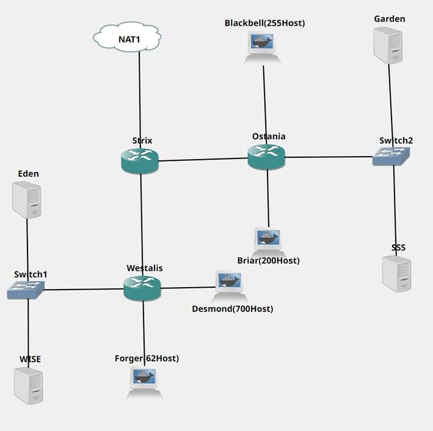
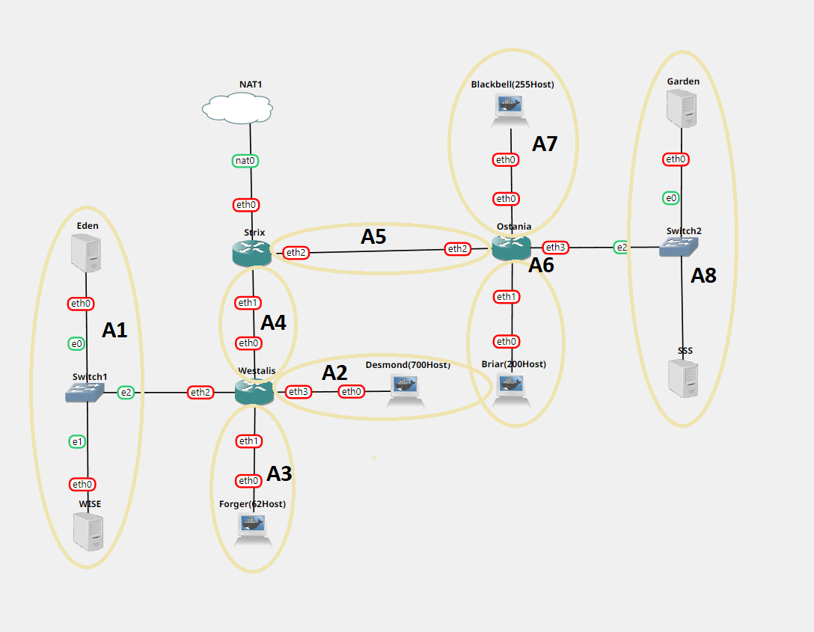

# Jarkom-Modul-5-ITA07-2022

## Laporan Hasil Praktikum Modul 5 Kelompok ITA07

Anggota kelompok: 

| Nama                           | NRP          | 
| -------------------------------| -------------| 
| Naftali Salsabila Kanaya Putri    | `5027201012` | 
| Ariel Daffansyah Aliski           | `5027201058` | 
| Anak Agung Bintang Krisnadewi     | `5027201060` |

**Soal Shift Modul 5 - Firewall**

Adapun untuk topologi jaringan yang harus dibuat adalah sebagai berikut

Berikut adalah hasil topologi yang kami buat beserta pembagian subnetnya

